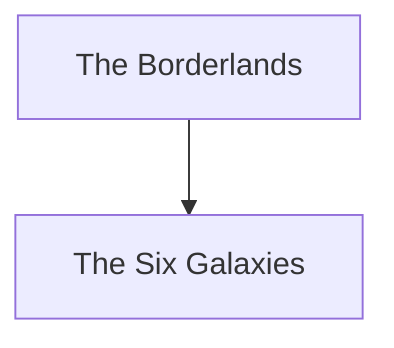

---
aliases:
- the Borderlands
- The Borderlands
- Celestica Eridiana
---

image | introduced in Borderlands 1
-- | --
Type | Galaxy/Frontier

> This is our home. But make no mistake, this is not a planet of peace and love.

\- Marcus Kincaid

# Overview
The Borderlands are the edges of civilization, the forefront of galactic exploration, and the strange and lawless rimworlds which are the main setting of the eponymous Borderlands series.

# Known Regions
*Planets in **bold** are physically visitable at some point the series.*
## Pandora and Surroundings
- **[[Pandora]]**: A deserted planet ruined by corporate greed. Also the planet where all of [[Borderlands 1]] and [[Borderlands 2|2]] take place, and where the story usually begins.
- **[[Elpis]]**: Pandora's moon, and also its Vault Key.
## Beta Ceti III (Eden System)
- Eden-1
- Eden-2
- Eden-3
- Eden-4
- Eden-5
- **[[Eden-6]]**: Home of the [[Jakobs]] corporation, and the site of a major arc in [[Borderlands 3]].
- Eden-7
## Other Planets and Moons
- Aquator
- Artemis
- **[[Athenas]]**: Maya's home planet. Location of one part of the Promethean Vault Key.
- Demophon
- Dionysus
- Eptah
- Eunomia
- **[[Gehenna]]**: A moon of a gas giant. Setting of [[Bounty of Blood]].
- Grophic IV
- Hephaestus: Home planet of Mister Torgue.
- Hera
- Hermes: Home planet of Alistair and Aurelia Hammerlock. Has a thin, helium-rich atmosphere.
- Hestias
- Hieronymous
- Honus 4651
- Isolus
- Junpai-7
- Menoetius
- **[[Nekrotafeyo]]**: Home planet (?) of the Eridians. Location of the Machine.
- **[[Promethea]]**: Headquarters of the [[Atlas]] corporation up until the Maliwan invasion forced them to evacuate to space, though they still maintain a heavy presence on the planet and their spaceship is in orbit. Site of a major arc in Borderlands 3, as well as [[New Tales]].
- Sercannus-3
- Tantalus
- Themis
- Thrace
- **[[Xylourgos]]**: A frozen rimworld not found on maps, kept in a perpetual eclipse. Setting of [[Guns, Love and Tentacles]].
# Etymology
The table below lists the etymology, if available, of the names of known planets and moons. Most of them reference Greek mythology, which is widely referenced in the Borderlands series as a whole.

Planet | Meaning/Namesake
--- | ---
Aquator | "Aqua" (water) + Equator
Artemis | Greek goddess of the hunt
Athenas | From Athena, Greek goddess of knowledge, warfare and law
Demophon | Either the son of Theseus and Phaedra or Demophoon, son of King Celeus and Queen Metanira; both from Greek myth
Dionysus | Greek god of wine, revelry and madness
Eden | Biblical garden of paradise
Elpis | Greek personification of hope; the last thing left inside Pandora's box
Eunomia | Greek goddess of legislation
Gehenna | A valley in Jerusalem. In Jewish theology, a place of divine punishment; hell, the destination of the wicked
Hephaestus | Greek god of smithing and fire
Hera | Greek goddess of women and marriage; wife of Zeus
Hermes | Greek god of messengers and thieves
Hestias | From Hestia, Greek goddess of hearth and home
Hieronymous | Either a Greek historical figure or Rob Heironimus, one of the founders of Gearbox Software
Isolus | A species of aliens from Doctor Who
Menoetius | Greek titan of anger and rash action
Nekrotafeyo | "Graveyard" in Greek
Pandora | First human woman in Greek myth; she was given a box containing all evil, pain and sorrow and told to not open it, which her husband's brother Epimetheus did
Promethea | From Prometheus, Greek titan and self sacrificial creator and educator of humanity; Pandora's husband
Tantalus | Greek mythological figure; a king who deceived the gods and was condemned to eternal suffering in Tartarus
Themis | Greek titaness of law
Thrace | A region in Greece
Xylourgos | "Carpenter" in Greek; a nod to John Carpenter, particularly the movie "The Thing"

# Trivia
1. Usually, the etymology of planet names is rarely addressed by the in-game characters, but Eden is the exception, with Typhon remarking Eden-6 is no paradise.

# Hierarchy

# Sources