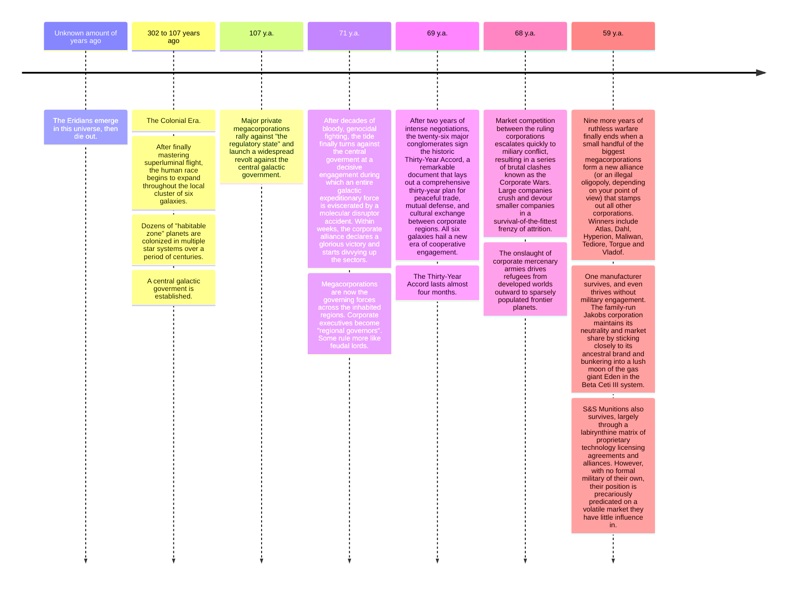

---
aliases:
  - The Six Galaxies
  - six galaxies
---

X | introduced in Borderlands 1
-- | --
Type | Galaxy cluster

> (...) You and me, brothers, selling the only weapons anyone would ever need in all six galaxies! But I reached out my hand and you spat in it Rhys. (...)

\- Katagawa Jr.

# Overview
The Six Galaxies is the galaxy cluster inhabited by humanity in the Borderlands series. It is not a figurative name - it has been confirmed that it is six separate galaxies.
Other galaxies do exist, but have not been reached, as it would require FTL technology of power and magnitude that has not yet been invented. [[Six Galaxies#^1|1]]

# Regions
- Celestica Eridiana, or the Borderlands: The forefront of galactic exploration, and where the story of the series takes place.
- Five other unnamed galaxies.

# History

# Trivia
- "The six galaxies" is often used by inhabitants of the Borderlands as a synonym for "universe" or "world".

# Hierarchy

# Sources
1. [Worlds of Borderlands](https://www.amazon.com/Worlds-Borderlands-Rick-Barba/dp/1506720498) ^1